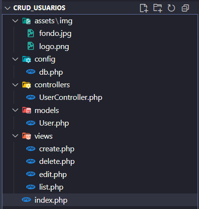

# 🚀 CRUD Usuarios (PHP + MySQL + Bootstrap)

Este proyecto es una prueba técnica desarrollada como parte de un proceso de selección para **Programador de Software**.  
El objetivo es implementar un sistema **CRUD (Crear, Leer, Actualizar, Eliminar)** de usuarios, utilizando **PHP nativo** y **MySQL**, siguiendo una arquitectura organizada tipo **MVC simplificado**.

🌐 **CRUD en producción:** https://webcruduser.infinityfreeapp.com/index.php  

---

## 🛠️ Tecnologías utilizadas

- **Backend:** PHP 8 (programación estructurada, conexión MySQLi)  
- **Frontend:** HTML5, CSS3, JavaScript, Bootstrap 5  
- **Base de Datos:** MySQL (local con XAMPP y remota en InfinityFree)  
- **Entorno local:** XAMPP (Apache + MySQL)  
- **Hosting gratuito:** InfinityFree  

---

## 🏗️ Arquitectura del Proyecto
El proyecto sigue una estructura modular clara, inspirada en MVC:



---

## 📋 Funcionalidades implementadas

✅ **Crear usuario** con validaciones (frontend y backend).  
✅ **Leer usuarios** en tabla responsive con Bootstrap.  
✅ **Actualizar usuario** con validaciones de duplicados.  
✅ **Eliminar usuario** mediante **Soft Delete** (cambia estado en lugar de borrar).  
✅ **Validación de email único** (no se permiten correos duplicados).  
✅ **Validación de teléfono** (solo números, longitud mínima/máxima, sin duplicados).  
✅ **Alertas dinámicas de Bootstrap** para feedback al usuario.  
✅ **Responsive design** → probado en escritorio y móvil.  
✅ **Navbar con enlace directo a GitHub**.  
✅ **Imagen de fondo con efecto glass** para un estilo moderno.  

---

## ✨ Mejoras adicionales (Extras)

1. Uso de Soft Delete en lugar de eliminación definitiva.  
2. Validaciones con expresiones regulares en nombres, apellidos y teléfonos.  
3. Mensajes de retroalimentación visual con Bootstrap (success, info, danger).  
4. Diseño moderno y responsivo con imagen de fondo y panel transparente.  
5. Preparado para extenderse como API REST + frontend en React.  

---

## 🗄️ Estructura de la Base de Datos

```sql
CREATE TABLE usuarios (
    id INT AUTO_INCREMENT PRIMARY KEY,
    nombres VARCHAR(100) NOT NULL,
    apellidos VARCHAR(100) NOT NULL,
    telefono VARCHAR(20) NOT NULL UNIQUE,
    email VARCHAR(100) NOT NULL UNIQUE,
    fecha_registro TIMESTAMP DEFAULT CURRENT_TIMESTAMP,
    fecha_ultima_modificacion TIMESTAMP DEFAULT CURRENT_TIMESTAMP 
        ON UPDATE CURRENT_TIMESTAMP,
    estado TINYINT(1) NOT NULL DEFAULT 1
);
