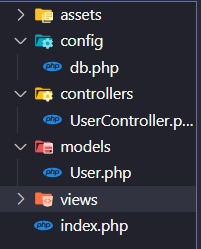

# 🚀 CRUD Usuarios (PHP + MySQL + Bootstrap)


---

> 💻 Proyecto desarrollado como parte de una **prueba técnica** para el cargo de **Programador de Software**.  
> El objetivo es implementar un sistema **CRUD (Crear, Leer, Actualizar, Eliminar)** de usuarios utilizando **PHP nativo**, **MySQL** y **Bootstrap**, bajo una **arquitectura MVC simplificada**.

🌐 **Versión en producción:**  
👉 [https://webcruduser.infinityfreeapp.com/](https://webcruduser.infinityfreeapp.com/)

---

## 🛠️ Tecnologías utilizadas

- **Backend:** PHP 8.3 (programación estructurada con MySQLi)
- **Frontend:** HTML5, CSS3, JavaScript, Bootstrap 5
- **Base de Datos:** MySQL (XAMPP e InfinityFree)
- **Entorno local:** XAMPP (Apache + MySQL)
- **Hosting gratuito:** InfinityFree

---

## 🏗️ Arquitectura del Proyecto

El sistema sigue una estructura modular clara, inspirada en el patrón **MVC (Modelo - Vista - Controlador)**:



---

## 📋 Funcionalidades implementadas

✅ **Crear usuario** con validaciones frontend y backend  
✅ **Leer usuarios** en tabla responsive con Bootstrap  
✅ **Actualizar usuario** con validaciones de duplicados  
✅ **Eliminar usuario** mediante **Soft Delete** (estado = 0)  
✅ **Validación de email y teléfono únicos**  
✅ **Búsqueda por nombre** (`LIKE %nombre%`)  
✅ **Alertas dinámicas de Bootstrap** (success, info, danger)  
✅ **Diseño moderno, responsive y con fondo personalizado**  
✅ **Navbar con enlace directo al repositorio GitHub**

---

## ✨ Mejoras adicionales (Extras)

1. Soft Delete en lugar de eliminación física
2. Expresiones regulares para validar nombres, apellidos y teléfonos
3. Retroalimentación visual mediante alertas Bootstrap
4. Fondo con efecto glass y transparencia
5. Proyecto preparado para extenderse a una **API REST + frontend React**

---

## 🗄️ Estructura de la Base de Datos

```sql
CREATE TABLE usuarios (
    id INT AUTO_INCREMENT PRIMARY KEY,
    nombres VARCHAR(100) NOT NULL,
    apellidos VARCHAR(100) NOT NULL,
    telefono VARCHAR(20) NOT NULL UNIQUE,
    email VARCHAR(100) NOT NULL UNIQUE,
    fecha_registro TIMESTAMP DEFAULT CURRENT_TIMESTAMP,
    fecha_ultima_modificacion TIMESTAMP DEFAULT CURRENT_TIMESTAMP
        ON UPDATE CURRENT_TIMESTAMP,
    estado TINYINT(1) NOT NULL DEFAULT 1
);
```
